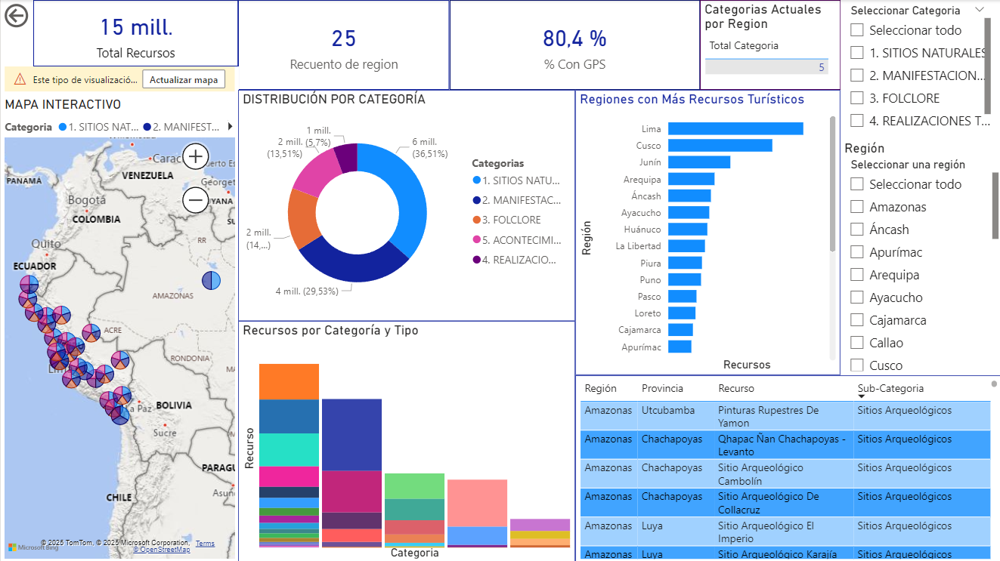

# 🏔️ Análisis de Recursos Turísticos del Perú

[](https://www.python.org/)
[](https://pandas.pydata.org/)
[](https://powerbi.microsoft.com/)
[](http://opendefinition.org/licenses/odc-by/)

Proyecto de análisis de datos sobre el **Inventario Nacional de Recursos Turísticos del Perú**, utilizando datos oficiales del **MINCETUR**.

---

## 📊 Descripción del Proyecto

Este proyecto realiza **limpieza, análisis y visualización** de **5,514 recursos turísticos** del Perú, incluyendo:
- 🏛️ Sitios arqueológicos
- 🎭 Manifestaciones culturales
- 🏞️ Sitios naturales
- 🎪 Acontecimientos programados
- Y más...

---

## 🎯 Objetivos

1. **Limpiar y estandarizar** datos del MINCETUR
2. **Analizar la distribución geográfica** de recursos turísticos
3. **Identificar patrones** por región y categoría
4. **Crear dashboards interactivos** para visualización de datos
5. **Documentar el proceso** para replicabilidad

---

## 🗂️ Estructura del Proyecto
```
Tourism_Project/
├── data/
│   ├── raw/                          # Datos originales sin procesar
│   │   └── inventario_recursos_turisticos.csv
│   └── cleaned/                      # Datos limpios y procesados
│       ├── inventario_recursos_turisticos_limpio.csv
│       ├── inventario_recursos_turisticos_limpio.xlsx
│       └── resumen_limpieza.txt
├── notebooks/
│   └── limpieza_datos.ipynb         # Análisis exploratorio detallado
├── scripts/
│   └── clean_data.py                # Script automatizado de limpieza
├── dashboards/
│   └── power_bi/
│       ├── Dashboard_Turismo_Peru.pbix
│       └── screenshots/             # Capturas del dashboard
├── requirements.txt                 # Dependencias del proyecto
├── .gitignore
└── README.md
```

---

## 🔧 Instalación y Configuración

### **Prerrequisitos**
- Python 3.11 o superior
- Git
- Jupyter Notebook
- Power BI Desktop (opcional, para visualización)

### **Pasos de instalación**
```bash
# 1. Clonar el repositorio
git clone https://github.com/AymeContinental/Projects-Data-Science-and-Data-Analysis.git
cd Tourism_Project

# 2. Crear entorno virtual
python -m venv Tourism

# 3. Activar entorno virtual
# Windows:
Tourism\Scripts\activate
# Linux/Mac:
source Tourism/bin/activate

# 4. Instalar dependencias
pip install -r requirements.txt
```

---

## 🚀 Uso del Proyecto

### **1. Ejecutar limpieza de datos**
```bash
python scripts/clean_data.py
```

**Salida esperada:**
- Archivo CSV limpio en `data/cleaned/`
- Archivo Excel para revisión
- Resumen del proceso de limpieza

### **2. Explorar análisis en Jupyter**
```bash
jupyter notebook notebooks/limpieza_datos.ipynb
```

El notebook incluye:
- Carga y exploración inicial de datos
- Identificación de problemas de calidad
- Proceso de limpieza paso a paso
- Análisis exploratorio con visualizaciones
- Exportación de datos limpios

### **3. Visualizar dashboard en Power BI**

Abre el archivo:
```
dashboards/power_bi/Dashboard_Turismo_Peru.pbix
```

---

## 📈 Resultados Clave

### **Estadísticas Generales**

| Métrica | Valor |
|---------|-------|
| **Total de Recursos** | 5,514 |
| **Departamentos Cubiertos** | 25 |
| **Recursos con GPS** | 4,431 (80.4%) |
| **Provincias** | 196 |
| **Categorías** | 5 principales |

### **Distribución por Categoría**

1. **Manifestaciones Culturales** - ~36.5%
2. **Sitios Naturales** - ~29.9%
3. **Folklore** - ~14.3%
4. **Acontecimientos Programados** - ~13.5%
5. **Realizaciones Técnicas** - ~5.7%

### **Top 5 Regiones**

1. 🥇 **Lima** - Mayor cantidad de recursos
2. 🥈 **Cusco** - Rico patrimonio cultural
3. 🥉 **Arequipa** - Diversidad turística
4. **Junín** - Recursos naturales
5. **Áncash** - Sitios arqueológicos

---

## 📊 Dashboard Interactivo

### **Power BI**

El dashboard incluye **3 páginas interactivas:**

#### **Página 1: Resumen Ejecutivo**
- KPIs principales (Total recursos, regiones, % con GPS)
- Mapa interactivo con geolocalización
- Top 10 regiones con más recursos
- Distribución por categoría
- Tabla de detalles con filtros



#### **Página 2: Análisis Geográfico**
- Mapa de calor por región
- Análisis por categoría y tipo
- Distribución provincial

#### **Página 3: Enfoque en Cusco**
- Análisis detallado de la región Cusco
- Distribución por provincias
- Principales recursos turísticos

---

## 🛠️ Tecnologías Utilizadas

### **Lenguajes y Librerías**
-  **Python 3.11**
-  **Pandas** - Manipulación de datos
-  **NumPy** - Operaciones numéricas
-  **Matplotlib** - Visualización
-  **Seaborn** - Visualización estadística

### **Herramientas de Análisis**
-  **Jupyter Notebook** - Análisis interactivo
-  **Power BI** - Dashboards interactivos

### **Control de Versiones**
-  **Git & GitHub** - Versionamiento

---

## 📁 Fuente de Datos

**MINCETUR** - Ministerio de Comercio Exterior y Turismo del Perú

- **Portal:** [Datos Abiertos del Gobierno Peruano](https://www.datosabiertos.gob.pe/)
- **Dataset:** Inventario Nacional de Recursos Turísticos
- **URL Directa:** [Descargar CSV](https://www.mincetur.gob.pe/Datos_abiertos/DGET/Inventario_recursos_turisticos.csv)
- **Última actualización:** Diciembre 2024
- **Licencia:** Open Data Commons Attribution License

---

## 🔄 Proceso de Limpieza de Datos

### **Problemas Identificados:**
1. ❌ Codificación incorrecta de caracteres especiales (ñ, tildes)
2. ❌ Valores nulos en múltiples columnas
3. ❌ Inconsistencias en nombres de categorías
4. ❌ Coordenadas geográficas faltantes
5. ❌ Duplicados (0 encontrados)

### **Transformaciones Aplicadas:**
1. ✅ Corrección de encoding (Latin-1)
2. ✅ Estandarización de nombres de columnas
3. ✅ Limpieza y capitalización de valores de texto
4. ✅ Imputación de valores nulos ("NO ESPECIFICADO")
5. ✅ Validación de coordenadas GPS
6. ✅ Creación de columnas derivadas (ID único, flag de coordenadas)

### **Resultados:**
- **Antes:** 5,514 registros | 12 columnas | 2,166 valores nulos
- **Después:** 5,514 registros | 14 columnas | Datos optimizados

---

## 💡 Insights Principales

### **Hallazgos Clave:**

1. **🗺️ Cobertura Geográfica**
   - El 80.4% de los recursos tienen coordenadas GPS
   - 1,083 recursos requieren geolocalización

2. **🏛️ Patrimonio Cultural**
   - Las manifestaciones culturales dominan con 36.5%
   - Cusco concentra gran parte del patrimonio arqueológico

3. **🌿 Diversidad Natural**
   - Casi el 30% son sitios naturales
   - Oportunidad para turismo ecológico

4. **📍 Distribución Regional**
   - Lima, Cusco y Arequipa lideran en cantidad
   - Algunas regiones están sub-representadas

---

## 🎓 Aprendizajes del Proyecto

- ✅ Manejo de datos con problemas de codificación
- ✅ Limpieza y transformación de datasets reales
- ✅ Análisis exploratorio de datos (EDA)
- ✅ Creación de dashboards interactivos en Power BI
- ✅ Documentación técnica de proyectos
- ✅ Buenas prácticas de versionamiento con Git

---

## 🚀 Próximas Mejoras

- [ ] Integrar datos de flujo turístico por región
- [ ] Añadir análisis de temporalidad (temporada alta/baja)
- [ ] Geocodificar recursos sin coordenadas
- [ ] Crear modelo predictivo de popularidad
- [ ] Desarrollar dashboard en Looker Studio
- [ ] Implementar API para consultas

---

## 👤 Autor

**Johan Ayme Nina**

- 💼 LinkedIn: [Johan Ayme Nina](https://www.linkedin.com/in/johan-ayme-nina-3941722b4)
- 📧 Email: [aymeninajohan@gmail.com](mailto:aymeninajohan@gmail.com)
- 🎓 Email Institucional: [75939254@continental.edu.pe](mailto:75939254@continental.edu.pe)
- 💻 GitHub: [@AymeContinental](https://github.com/AymeContinental)

---

## 📄 Licencia

Este proyecto utiliza datos bajo la licencia **Open Data Commons Attribution License**.

Los datos originales son propiedad del **MINCETUR** y están disponibles en el portal de Datos Abiertos del Gobierno Peruano.

---

## 🙏 Agradecimientos

- **MINCETUR** por proporcionar datos abiertos de calidad
- **Gobierno del Perú** por la iniciativa de datos abiertos
- Comunidad de Python y Power BI por las herramientas

---

## 📞 Contacto

¿Preguntas sobre el proyecto? ¿Interesado en colaborar?

**Contáctame:**
- 📧 aymeninajohan@gmail.com
- 💼 [LinkedIn](https://www.linkedin.com/in/johan-ayme-nina-3941722b4)

---

⭐ **Si te gustó este proyecto, dale una estrella en GitHub!**

---

**Última actualización:** Diciembre 2024